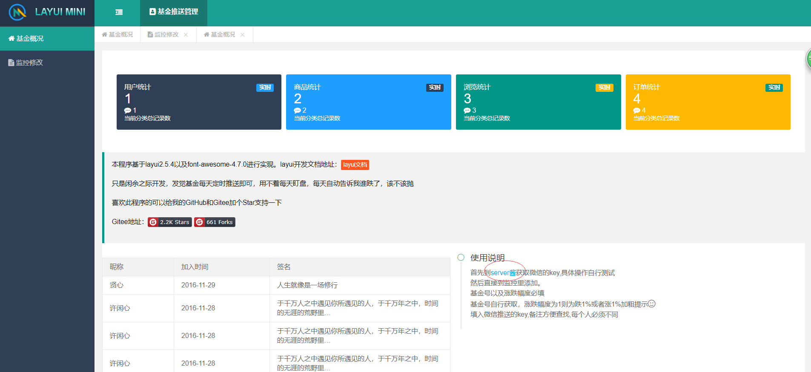
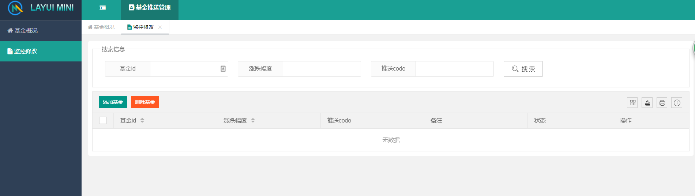
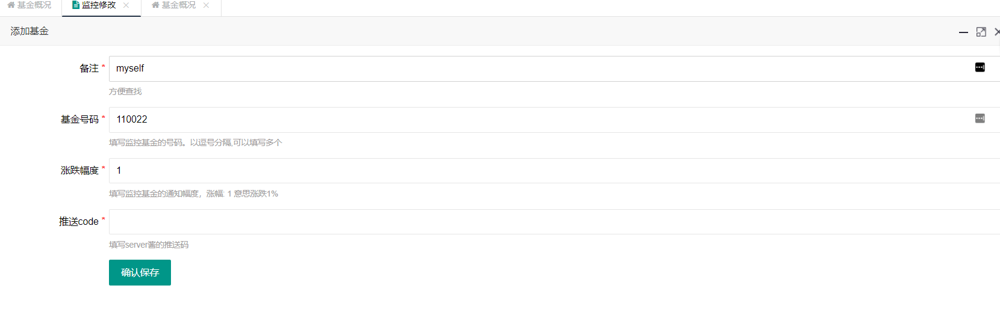
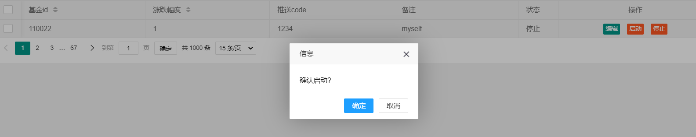
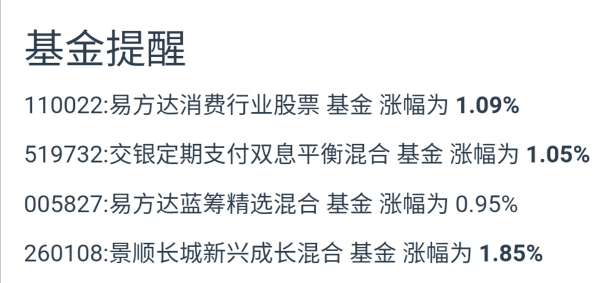

# 基金定时推送

为了不浪费时间在盯盘上，每天14:30定时推送自己所选基金到微信上，大于规定幅度则会进行加粗提示

原本是给家人推送的，奈何他们不用，就自己用了，2333
公开代码吧，其实没啥技术含量，就爬虫，做了个web界面，可以设置多个人账号进行提醒，需要修改的自行修改吧

界面没怎么改了，完成功能就行，可以给自己的家人以及朋友定时推送基金涨跌

其实github action就可以完成，但是服务器闲置没用，写着玩玩

## 使用说明

首先到首页进入到server酱，获取sckey,后面会用到


然后进入监控修改，点击添加基金即可，


这里填入第一步获取的sckey


点击启动会卡顿一段时间，这里没做异步处理了，直接等待结果返回，会直接发送一次到微信上，若没收到，则添加出现问题


每日效果如图


至于后续维护，应该没有，也没必要维护，自己玩玩就好了

## 配置说明
config.py里存了web界面的账号密码，自行修改

环境配置问题自己解决
服务器端直接启动即可，8080为端口号
```bash
pip3 install -r requirements.txt
nohup flask run -h 0.0.0.0 -p 8080 &
```
